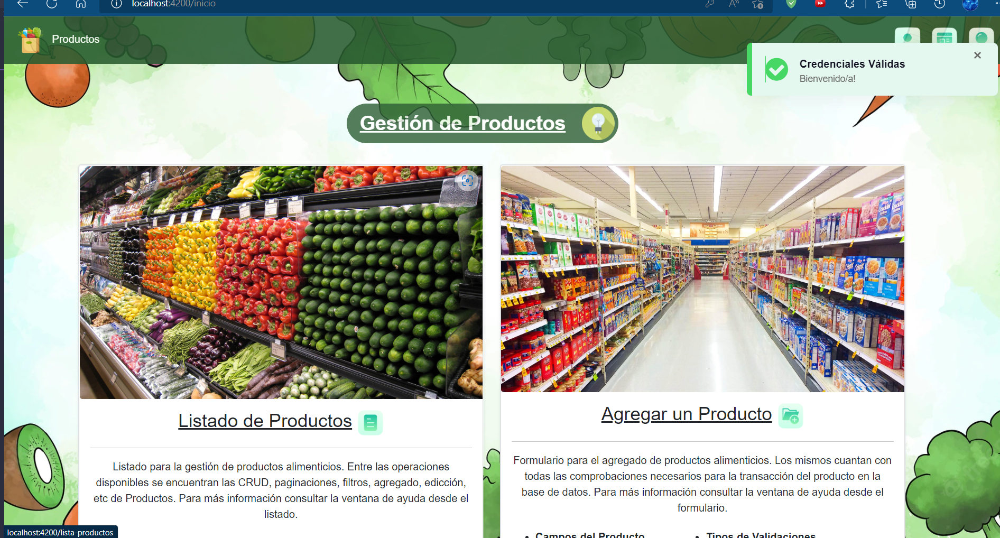

# App MicroFrontEnd Productos de Supermercado
Micro Front End acerca de productos de supermercado implementando Angular, Bootstrap, SCSS, HTML5, Highchart, Spring-Boot, Spring Security, Spring MVC, Microservicios, SpringFox, Swagger UI, Git, DBeaver, PgAdmin, PostgreSQL y Otras Tecnologías.

* [Repositorio Api Rest](https://github.com/andresWeitzel/ApiRest_MicroFrontEnd_ProductosSupermercado)
* [Repositorio base de datos](https://github.com/andresWeitzel/Microdb_productos_supermercado_PostgreSQL)
* [PlayList pruebas de funcionalidad](https://www.youtube.com/playlist?list=PLCl11UFjHurBcKBhduZ4suiDSMbyyBqCO)

 

## Índice 📜

 
 Ver 

 
  
 
### Sección 1) Descripción, Tecnologías y Dependencias 

 - [1.0) Descripción del Proyecto.](#10-descripción-)
 - [1.1) Ejecución del Proyecto.](#11-ejecución-del-proyecto-)
 - [1.2) Tecnologías.](#12-tecnologías-)

  
### Sección 2) Endpoints y Recursos 
 
 - [2.0) EndPoints.](#endpoints-)
 - [2.1) Recursos y Servicios.](#recursos-y-servicios-)
  
  
### Sección 3) Prueba de Funcionalidad y Referencias
 
 - [3.0) Prueba de Funcionalidad.](#30-prueba-de-funcionalidad-)
 - [3.1) Referencias.](#31-referencias-)
	  
  
  
 

 

## Sección 1) Descripción, Tecnologías y Dependencias 

### 1.0) Descripción [🔝](#índice-) 

  
Ver

 
  
 
* El enfoque de la aplicación es la gestión de productos, si bien se ha desarrollado también el back para la gestión de usuarios, este recurso aplica solo desde la Api, con postman o desde swagger ui, se implementa el Modelo de Negocios para un MicroFrontEnd, por ende se deberá desarrollar otra app para la gestión de dichos usuarios. 
* Como sistema de seguridad para manejo de recursos de la app se usa Spring Security y JWT. Las Operaciones Transaccionales fueron modificadas para que solamente los administradores del sistema tengan acceso, los usuarios convencionales solamente podrán visualizar los productos y filtrar búsquedas acerca de estos según el requerimiento deseado.
* Todos los formularios aplican validaciones de carácteres, longitudes, tamaños, valores numéricos, valores mal formados, email, contraseña, url de imágenes, etc.
* Se implementa Paginación Completa.
* Se aplican dos filtros de búsqueda, uno para productos de forma genérica y otro según el campo deseado, permitiendo coincidencias de carácteres y palabras.
* Para la experiencia de usuario se utiliza Popupts, Loaders, Angular Material, Etc.
* Es posible descargar el Listado de Productos Paginado en formato xlsx(excel), csv y pdf.
* Todas las Páginas de la Aplicación poseen modals de Ayuda.
* Entre Otros Recursos Disponibles.
* Aclaración : ESTE MICROFRONTEND NO ES COMPLETAMENTE RESPONSIVE. El enfoque es la funcionalidad de la aplicación, la maquetación es totalmente aplicable en relación al tiempo de disponibilidad que se emplee.  

 

* [Repositorio Api Rest](https://github.com/andresWeitzel/ApiRest_MicroFrontEnd_ProductosSupermercado)
* [Repositorio base de datos](https://github.com/andresWeitzel/Microdb_productos_supermercado_PostgreSQL)
* [PlayList pruebas de funcionalidad](https://www.youtube.com/playlist?list=PLCl11UFjHurBcKBhduZ4suiDSMbyyBqCO)

 

### 1.1) Ejecución del Proyecto [🔝](#índice-)

  
Ver

  
    
  
* Crear un entorno de trabajo a través de algún IDE
* Clonar el Proyecto (`git clone https://github.com/andresWeitzel/App_MicroFrontEnd_Productos_Supermercado`)
* Posicionarnos sobre el proyecto
  * `cd proyecto`
* Dentro del directorio instalar todos los plugins implementados
  * `npm i`
* Ejecutar la base de datos
* Ejecutar la api rest
* Ejecutar el proyecto
  * `ng serve`

 

### 1.2) Tecnologías [🔝](#índice-)

  
Ver

 
  

| Tecnologías FRONTEND | Versión | Finalidad
| ------------- | ------------- | ------------- |
| [HTML](https://www.w3schools.com/html/) |  5.0 | Lenguaje de Hipertexto | 
| [Css](https://www.w3schools.com/css/) |  3.0 | Lenguaje de hojas de estilo para presentación de documentos.  |
| [Scss](https://sass-lang.com/) | 1.57 | Preprocesador de css.  |
| [Angular](https://angular.io/) |  13.3.0 | FrameWork Web Desarrollo de Apps con TypeScript | 
| [Angular CLI](https://docs.angular.lat/cli) | 13.3.0 | Herramienta de Angular para depurar, crear, publicar, etc Apps |
| [Angular Material](https://material.angular.io/) | 13.3.9 | UI librería de componentes | 
| [ng-angular-popup](https://www.npmjs.com/package/ng-angular-popup) | 0.1.2 |  Mensajes emergentes personalizados |
| [jspdf/html2canvas](https://www.npmjs.com/package/jspdf-html2canvas) | - | Pdf Export| 
| [xlsx](https://www.npmjs.com/package/xlsx) | - | Excell/Csv Export| 
| [ngx-ui-loader](https://www.npmjs.com/package/ngx-ui-loader) | 13.0.0 | Animaciones de carga | 
| [Highchart](https://www.highcharts.com/) | 13.3.9 | Librería para la generación de gráficos |  
| [Bootstrap](https://getbootstrap.com/) | 5.1  | FrameWork Web Diseño y Desarrollo de Apps |
| [Visual Studio Code](https://code.visualstudio.com/download) | 1.51.1  | Entorno de Desarrollo |

| Tecnologías BACKEND | Versión | Finalidad
| ------------- | ------------- | ------------- |
| [Java]( https://www.oracle.com/java/technologies/javase/jdk12-archive-downloads.html) |   12.0.2 | JDK |
| [Spring Tool Suite 4](https://spring.io/blog/2021/06/21/spring-tools-4-11-0-released) | 4.9.0  | IDE |
| [Spring Boot](https://spring.io/) |   2.6.4  | Framework |
| [Spring Boot Data JPA](https://spring.io/projects/spring-data-jpa)  | 2.6.3 | Mapeo de objetos y persistencia en la db |
| [Spring Security](https://spring.io/projects/spring-security) | 2.6.7 | Servicios de Seguridad |
| [JSON Web Token](https://jwt.io/) | 0.9.1 | Creación de tokens de acceso | 
| [Maven](https://maven.apache.org/) |  4.0.0 | Gestor de Proyectos |
| [Postman](https://www.postman.com/) | 9.4.1 | Test de Apis |
| [Lombok](https://projectlombok.org/) | 1.18.22 | Automatización de Código | 
| [Open-Api](https://www.openapis.org/) | 1.6.4 | Documentación de la Api | 
| [UI Swagger](https://swagger.io/tools/swagger-ui/) | 1.6.4 | Visualización y Gestión de la Api | 
| [GNU bash / Terminal](https://www.gnu.org/software/bash/) | 4.4.23  | Bash / Terminal para el manejo e implementación de Git integrado al Spring Tool Suite |
| [Git](https://git-scm.com/) | 2.29.1  | Control de Versiones |

| Tecnologías DATABASE | Versión | Finalidad
| ------------- | ------------- | ------------- |
| [PostgreSQL](https://www.postgresql.org/) | 13.2 | Sistema de Gestión de DB'S |
| [DBeaver](https://dbeaver.io/) | 22.1  | Editor de Base de Datos |
| [pgAdmin](https://github.com/pgadmin-org/pgadmin4) | 5.1 | Sistema de Administración de DB'S |

 

 

## Sección 2) EndPoints y Recursos

### 2.0) EndPoints [🔝](#índice-)

 
Ver

   

 

### 2.1) Recursos y Servicios [🔝](#índice-)

 
Ver

  

### Seguidamente se Representa Gráficamente de Forma Sucinta algunos Servicios y Recursos de la Aplicación.

 

#### Login 

#### Signin

#### Inicio Post Login 

 

#### Servicios Deshabilitados para Usuarios 

 

#### Listado de Productos Formato Tabla

#### Listado de Productos Formato Cards

#### Listado de Productos Archivo csv

#### Listado de Productos Archivo pdf

#### Listado de Productos sección Paginado 

 

#### Checks Form Editar Producto 

 

#### Checks Form Agregar Producto Insertado

#### Producto Insertado Filtrado en Lista

 

#### Check Eliminar Producto

#### Check Lista Producto Eliminado

 

#### Documentación Gráfica Acotada por razones de simplificación de documentación. Visualizar los videos anexados acerca de las Pruebas de Funcionalidad de la aplicación.

 

 

## Sección 3) Prueba de Funcionalidad y Referencias

### 3.0) Prueba de Funcionalidad [🔝](#índice-)

 
Ver

#### Auth ( Login y Signin )
 
 

#### Auth ( Refresh Token )
 
 

#### Análisis de Seguridad ( Cifrado de Token )
 

 

#### Análisis de Seguridad ( Credenciales en JWT )
 

 

#### Metodología de Cifrado de Token AES SHA-256
 

 

#### Alojamiento de Imágenes en Servidor
 

 

#### Archivos de Descarga ( XLSX, CSV, PDF)
 

 

#### Configuración de Lista Formato Tabla/Card
 

 

#### Filtros Personalizados
 

 

#### Filtros por Campos y Generales
 

 

#### Paginado de Tabla y Ordenamientos de Productos

 

  
  
### `Se resume documentación gráfica. Visualizar Playlist del proyecto para más funcionalidades`  

  

### 3.1) Referencias [🔝](#índice-)

 
Ver

### Documentación Oficial Tecnologías

* [Java-JDK 12](https://www.oracle.com/java/technologies/javase/jdk12-archive-downloads.html)
* [Spring Security](https://spring.io/projects/spring-security)  
* [JSON Web Security](https://jwt.io/introduction/) 
* [Boostrap](https://getbootstrap.com/)
* [Angular CLI](https://github.com/angular/angular-cli)
* [XAMPP](https://www.apachefriends.org/download.html) 
* [Maven Repository](https://mvnrepository.com/) 
* [PostMan](https://www.postman.com/downloads/) 
* [Bootstrap](https://getbootstrap.com/)
* [Angular](https://angular.io/tutorial/toh-pt0)
* [Visual Studio Code](https://code.visualstudio.com/download)
* [Spring Tool Suite 4](https://spring.io/tools) 
* [Git](https://git-scm.com/docs)
* Otros

 

### Documentación Oficial/No Oficial Librerías Frontend

* Angular Popup
    * [Instalación](https://www.npmjs.com/package/ng-angular-popup)   

* Angular Material
    * [Instalación](https://material.angular.io/guide/getting-started) 

* Angular Bootstrap Validation 
    * [Instalación](https://mdbootstrap.com/docs/b5/angular/getting-started/installation/)
    * [Implementación/ejemplos](https://mdbootstrap.com/docs/b5/angular/getting-started/installation/)
    * [Validation Forms(tanto bootstrap 4 como 5](https://mdbootstrap.com/docs/angular/forms/validation/)

* ngx ui loader 
    * [Instalación](https://www.npmjs.com/package/ngx-ui-loader)
    * [Implementación](https://tdev.app/ngx-ui-loader)

* Excel Sheets
    * [Instalación y Doc](https://www.npmjs.com/package/xlsx)
    * [Ejemplo Base](https://www.delftstack.com/howto/angular/angular-export-to-excel/)
    
* JSPDF
    * [Ejemplo Base](https://www.positronx.io/angular-pdf-tutorial-export-pdf-in-angular-with-jspdf/)
    * [Otro ej.](https://howtojs.io/how-to-generate-pdf-file-in-angular-13-application-in-multiple-ways/)

* Gráficos con Highchart
    * [Npm, config, detalles, etc](https://hackthestuff.com/article/how-to-use-highcharts-in-angular-12)
    * [Doc Oficial](https://api.highcharts.com/highcharts/)
    * [Doc Oficial Instalación](https://www.highcharts.com/docs/getting-started/install-from-npm)
    
* Tipos de Gráficos Highchart
    * [Nuevo sitio Tipos de Graf](https://www.highcharts.com/blog/chartchooser/)
    * [Ejemplo Base 2d](https://stackblitz.com/edit/highcharts-angular-basic-line-ucnkbj?file=src%2Fapp%2Fapp.component.ts)
    * [Modificación Gráfico 2d a 3d](https://www.eduforbetterment.com/3d-pie-and-donut-chart-in-angular-using-highchart/)

* Treemap Graphic
    * [Ej. Base](https://stackblitz.com/edit/highcharts-angular-treemap?file=app%2Fapp.component.ts)
    * [Ej. Base algunas configs](https://jsfiddle.net/gh/get/library/pure/highcharts/highcharts/tree/master/samples/highcharts/demo/treemap-with-levels)

* Cifrado Token (CriptoJs) y Secure Local Storage
    * [Guía de Uso](https://rupesh94.medium.com/how-to-encrypt-localstorage-data-in-angular-270ebcbc1435)
    * [Instalación Secure Local Storage](https://www.npmjs.com/package/secure-web-storage?activeTab=readme)
    * [Instalacion CryptoJs](https://www.npmjs.com/package/crypto-js)

 

